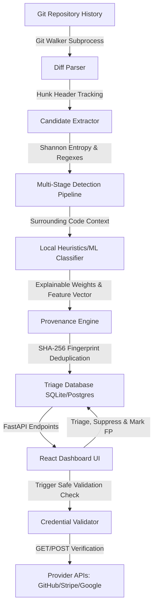

# SecretTrace AI — Find the secrets Git forgot.


Video Demo : https://www.youtube.com/watch?v=QIyEhNhDRXc

[](https://github.com/alwaysalearner1234/Hallucination_hunter/actions/workflows/secrettrace.yml)
[](LICENSE)

**SecretTrace AI** is a low-noise, production-ready Git secret scanner and credential lifecycle (provenance) tracking platform. 

Unlike traditional scanners that only inspect the current working tree or flood security logs with naive regex-based false positives (like test keys or placeholders), SecretTrace AI traverses the **entire Git history**, resolves deleted credentials, applies a **hybrid Heuristics/ML Classifier** to filter out noise, reconstructs the **lifecycle timeline** of every secret, and performs **safe, on-demand validation**.

---

## 1. The Core Problem & Our Solution

Traditional secret scanners ask: *"Does this string match a high-entropy credential format?"* This naive check creates a huge volume of false positives by flagging values like:
* `API_KEY="your-api-key-here"` (Placeholders)
* `STRIPE_KEY="sk_test_..."` (Test fixtures)
* `export OPENAI_API_KEY="sk-example..."` (Documentation examples)

At the same time, if a developer commits a real secret to a repository and deletes it in a later commit, a standard working-tree scanner will miss it entirely, even though it remains exposed forever inside the Git commit database.

### The SecretTrace AI Approach
1. **Traverse All Git History:** Crawls reachable commits, parent diffs, and deep-history elements (dangling commits, reflog entries) to detect deleted secrets.
2. **Context-Aware Classification:** Calculates Shannon entropy and parses surrounding variables, directory paths, and files to distinguish between real leaks and harmless code artifacts.
3. **Git Provenance Reconstruction:** Rebuilds a chronological timeline showing exactly when a credential was introduced, modified, copied, or deleted.
4. **On-Demand Validation:** Safely checks keys against live provider APIs (GitHub, Stripe, Google Cloud) without storing plaintext credentials in the database.

---

## 2. System Architecture



---

## 3. Technology Stack

* **Core Scanner CLI:** Python, Shannon Entropy, Extensible Regex Registry, Subprocess Git wrappers.
* **Backend API:** FastAPI, Uvicorn, SQLAlchemy ORM, SQLite (default dev database) / PostgreSQL (production-ready).
* **Frontend Dashboard:** React, Vite, TypeScript, Tailwind CSS, Lucide icons.
* **Benchmarks:** Local evaluation dataset (500 cases) measuring Precision, Recall, F1, and FPR.
* **Deployment:** Docker, Docker Compose, GitHub Actions CI/CD.

---

## 4. Quick Start

### Running with Docker Compose (Recommended)

To compile and boot the complete stack (Frontend, Backend, Database) in a single command, run:

```bash
docker compose up --build
```

Access the interfaces at:
* **Frontend Dashboard:** [http://localhost:5173](http://localhost:5173)
* **Backend REST API:** [http://localhost:8000](http://localhost:8000)
* **API Documentation:** [http://localhost:8000/docs](http://localhost:8000/docs)

---

### Running Locally for Development

#### 1. Backend Server Setup
Ensure Python 3.9+ is installed:

```bash
# Install dependencies
pip install -r backend/requirements.txt

# Start the FastAPI server (makes tables automatically)
$env:PYTHONPATH="."
python backend/app/main.py
```

#### 2. Frontend React Dashboard Setup
Ensure Node.js 18+ is installed:

```bash
cd frontend
npm install
npm run dev
```

---

## 5. Command-Line Interface (CLI)

SecretTrace AI includes a standalone CLI utility inside `scanner/cli.py` to scan directories directly.

```bash
# Add workspace to path
$env:PYTHONPATH="."

# Scan current working tree (default)
python scanner/cli.py .

# Scan entire Git commit log
python scanner/cli.py . --history

# Include unreachable reflogs and dangling commits
python scanner/cli.py . --deep-history

# Enable safe credential validation check
python scanner/cli.py . --history --validate

# Output standard SARIF format for GitHub Code Scanning integration
python scanner/cli.py . --history --sarif > reports.sarif

# Fail build (exit code 1) if High/Critical leaks are found
python scanner/cli.py . --history --fail-on high
```

---

## 6. API Documentation

Key endpoints exposed by the FastAPI server:
* `POST /api/scans`: Trigger a scan on a repository path or remote URL.
* `GET /api/scans/{scan_id}`: Track scan state and collection metrics.
* `GET /api/findings`: List deduplicated findings with filters.
* `GET /api/findings/{finding_id}`: Detailed finding metadata and code snippet.
* `GET /api/findings/{finding_id}/provenance`: Reconstruct the commit timeline.
* `POST /api/findings/{finding_id}/validate`: Trigger online provider checks.
* `PUT /api/findings/{finding_id}/status`: Set triage status (`FALSE_POSITIVE`, `RESOLVED`).

---

## 7. Security Model & Data Safeguards

* **Zero Plaintext Persistence:** Raw credential strings are **never** written to the database. SecretTrace AI stores a SHA-256 fingerprint for deduplication and a masked value (e.g. `sk_live_51N2x••••••••tuvw`) for display.
* **On-Demand Resolution:** When validating or fetching context, the backend extracts the secret dynamically from the local Git object store, runs the check, and discards it from memory.
* **Non-Destructive Validation:** Verification checks use read-only queries (e.g. `GET /user` for GitHub) and avoid state modifications or rate-limit lockouts.
#
